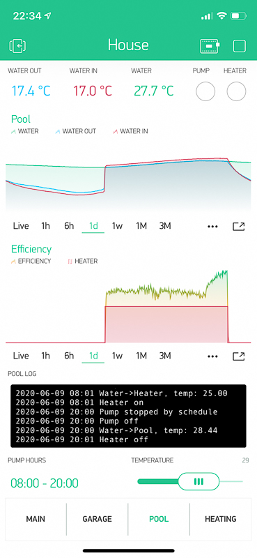

# Particle Photon
Code for controlling pump and heater for my pool.
Contains a blynk integration to visualize the current status



# Blynk token
The blynk token needs to be stored in a `src/BLYNK_SETTINGS.h` file with following content
```
#define BLYNK_TEMPLATE_ID "your template id here"
#define BLYNK_DEVICE_NAME "Pool"
#define BLYNK_AUTH_TOKEN "your token here"
```